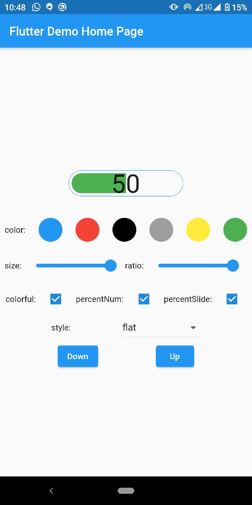
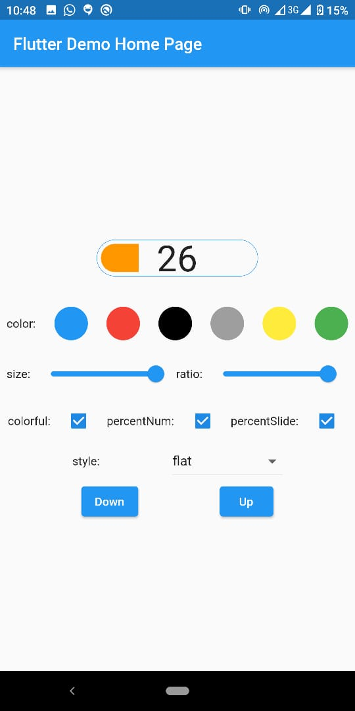
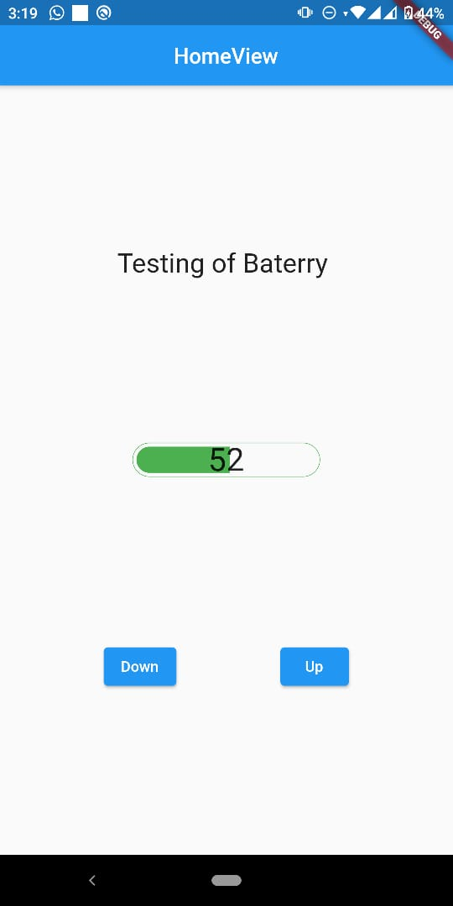
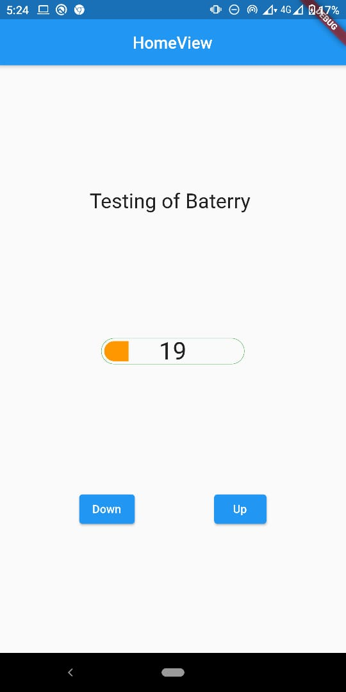

# flutter_battery_indicator :battery:

A battery indicator widget, you can use the phone battery value to display, and also you can provide your own value for the battery level.


## Screenshots :camera:

Example with native flutter

<p float="left">


</p>

Example with GetX

<p float="left">


</p>

## Usage :clipboard:

To use this plugin, add `battery_indicator` as a [dependency in your pubspec.yaml file](https://flutter.io/platform-plugins/).

```
dependencies:
  battery_indicator: ^0.1.0
```

### Examples :iphone:

### You can use your phone battery to display in the widget :one:

##### You can check this example in the folder [example]

```dart
// Import package
import 'package:battery_indicator/battery_indicator.dart';
...

// Instantiate it, by default it takes the battery from your phone
BatteryIndicator(
  style: BatteryIndicatorStyle.values[_styleIndex],
  colorful: _colorful,
  showPercentNum: _showPercentNum,
  mainColor: _color,
  size: _size,
  ratio: _ratio,
  showPercentSlide: _showPercentSlide,
);

// and then add it to your layout .

```

### Also you can provide your own battery value :two:

##### You can check this example in the folder [example_custom_battery]

```dart
// Import package
import 'package:battery_indicator/battery_indicator.dart';
...

//inside your statefull class, you can add functions
// to control the battery level, like this:

int bat = 34;

void increment() {
  setState(() {
    if (bat < 100) {
      bat++;
    }
  });
}

void decrement() {
  setState(() {
    if (bat > 0) {
      bat--;
    }
  });
}
...
// Instantiate it, add the flag batteryFromPhone, and a
// value to control the battery level
BatteryIndicator(
  batteryFromPhone: false,
  batteryLevel: bat,
  style: BatteryIndicatorStyle.values[_styleIndex],
  colorful: _colorful,
  showPercentNum: _showPercentNum,
  mainColor: _color,
  size: _size,
  ratio: _ratio,
  showPercentSlide: _showPercentSlide,
);

// and then add it to your layout .

```

### Also you can provide your own battery value with GetX :three:

##### You can check this example in the folder [example_custom_battery_get_x]

home_view.dart

```dart
 Obx(() => BatteryIndicator(
      batteryFromPhone: false,
      batteryLevel: controller.bat.value,
      style: controller.myStyle,
      colorful: controller.colorful,
      showPercentNum: controller.showPercentNum,
      mainColor: controller.color,
      size: controller.size,
      ratio: controller.ratio,
      showPercentSlide: controller.showPercentSlide)
  )
```

home_controller.dart

```dart
class HomeController extends GetxController {
  //0,flat and 1,skeumorphism
  BatteryIndicatorStyle myStyle = BatteryIndicatorStyle.values[0];

  var colorful = true;
  var showPercentSlide = true;
  var showPercentNum = true;
  var size = 35.0;
  var ratio = 6.0;
  Color color = Colors.blue;
  RxInt bat = RxInt(35);


  @override
  void onClose() {}
  void increment() {
    if (bat.value < 100) {
      bat.value++;
    }
  }
  void decrement() {
    if (bat.value > 0) {
      bat.value--;
    }
  }
}
```

## Special Thanks :+1:
[WilliBobadilla](https://github.com/WilliBobadilla)

## Getting Started :rocket:

For help getting started with Flutter, view our online [documentation](https://flutter.io/).

For help on editing package code, view the [documentation](https://flutter.io/developing-packages/).
